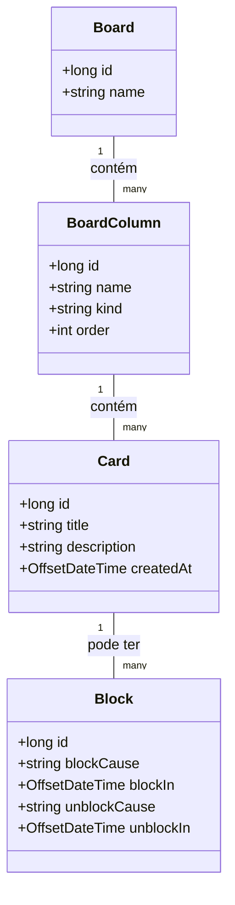

# ProjetoDashBoard

Criado um projeto de dashboard realizado totalmente por backend em Java e utilizado banco de dados.

## Descrição

Este projeto é um dashboard desenvolvido em Java que se comunica com um banco de dados para gerenciamento e visualização de dados. O objetivo é fornecer uma interface amigável para visualização e manipulação de informações armazenadas no banco de dados.

## Tecnologias Utilizadas

- **Java**: Linguagem de programação utilizada para o desenvolvimento do backend.
- **Banco de Dados - SQL**: Utilizado para armazenamento e recuperação de dados.

## Funcionalidades

- Autenticação de usuários
- Visualização de dados em gráficos e tabelas
- Filtros e buscas avançadas
- Gerenciamento de dados (CRUD)

## Estrutura do Projeto

A estrutura do projeto é organizada da seguinte maneira:

